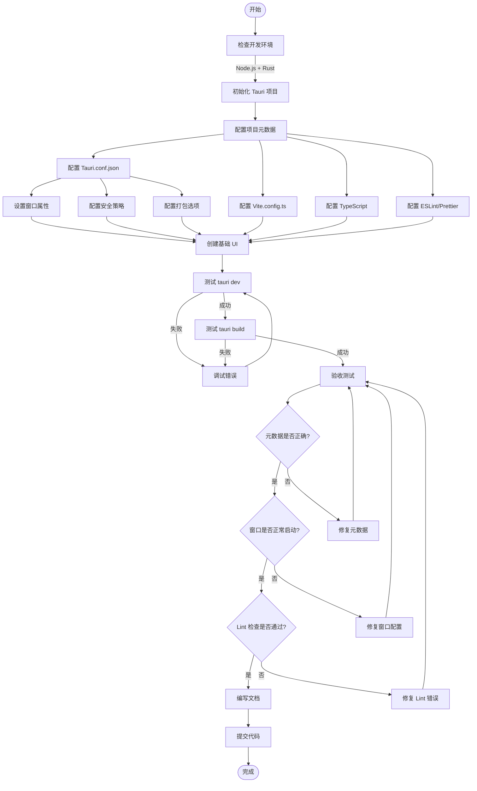
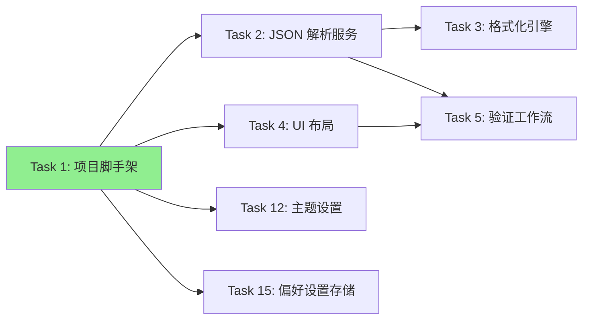

# Task 1: Tauri Project Scaffolding - 系统设计

## 1. 任务概述

### 1.1 目标
初始化 Tauri 应用程序基础架构，配置项目元数据，确保在 macOS 平台上能够成功构建和运行基础窗口应用。

### 1.2 验收标准
- ✅ 运行 `npm run tauri dev` 能在 macOS 上启动空白应用窗口
- ✅ 项目元数据（名称、版本、标识符）符合产品需求
- ✅ 仓库包含必要的配置文件（Tauri 配置、package 清单），配置无 lint 错误

---

## 2. 技术栈选型

### 2.1 前端技术栈
- **框架**: React 18.x
  - 理由：组件化开发、丰富的生态系统、优秀的开发者体验
  - 使用 TypeScript 提供类型安全
- **构建工具**: Vite 5.x
  - 理由：快速的冷启动、HMR 热更新、对 Tauri 的良好支持
- **UI 库**: 待定（可考虑 TailwindCSS 或 CSS Modules）
- **代码风格**: ESLint + Prettier

### 2.2 后端技术栈（Tauri Core）
- **运行时**: Tauri 1.x
- **编程语言**: Rust（Tauri 后端命令）
- **JSON 处理**: serde_json（Rust 官方推荐的 JSON 库）

### 2.3 开发环境要求
- Node.js 18.x 或更高版本
- Rust 1.70+ (通过 rustup 安装)
- Tauri CLI
- macOS 系统（目标平台）

---

## 3. 项目结构设计

```
tauri-json-tool/
├── src/                          # 前端源代码
│   ├── components/               # React 组件
│   ├── hooks/                    # 自定义 Hooks
│   ├── services/                 # 前端服务层（调用 Tauri Commands）
│   ├── types/                    # TypeScript 类型定义
│   ├── utils/                    # 工具函数
│   ├── styles/                   # 样式文件
│   ├── App.tsx                   # 根组件
│   ├── main.tsx                  # 前端入口文件
│   └── vite-env.d.ts             # Vite 类型声明
├── src-tauri/                    # Tauri 后端代码
│   ├── src/
│   │   ├── main.rs               # Rust 主程序入口
│   │   ├── commands/             # Tauri Commands（业务逻辑）
│   │   │   └── mod.rs
│   │   ├── models/               # 数据模型
│   │   │   └── mod.rs
│   │   └── utils/                # Rust 工具函数
│   │       └── mod.rs
│   ├── Cargo.toml                # Rust 依赖配置
│   ├── tauri.conf.json           # Tauri 配置文件
│   ├── build.rs                  # 构建脚本
│   └── icons/                    # 应用图标资源
├── docs/                         # 文档目录
│   ├── requirements.md
│   ├── task-breakdown.md
│   └── task-1-system-design.md   # 本文档
├── tests/                        # 测试文件
│   ├── unit/                     # 单元测试
│   └── e2e/                      # 端到端测试
├── .gitignore
├── package.json                  # Node.js 依赖配置
├── tsconfig.json                 # TypeScript 配置
├── vite.config.ts                # Vite 配置
├── .eslintrc.json                # ESLint 配置
└── README.md                     # 项目说明文档
```

---

## 4. 配置设计

### 4.1 项目元数据
```json
{
  "name": "json-formatter-validator",
  "productName": "JSON Formatter & Validator",
  "version": "0.1.0",
  "description": "A desktop utility app for validating and formatting JSON",
  "identifier": "com.jsontools.formatter"
}
```

### 4.2 Tauri 配置要点（tauri.conf.json）

#### 4.2.1 应用窗口配置
```json
{
  "tauri": {
    "windows": [
      {
        "title": "JSON Formatter & Validator",
        "width": 1200,
        "height": 800,
        "minWidth": 800,
        "minHeight": 600,
        "resizable": true,
        "center": true,
        "decorations": true,
        "fullscreen": false
      }
    ]
  }
}
```

**设计考量**：
- 默认窗口尺寸 1200x800：适合并排显示输入/输出面板
- 最小尺寸 800x600：确保垂直布局下依然可用
- 居中启动：提供良好的首次使用体验

#### 4.2.2 安全配置
```json
{
  "tauri": {
    "security": {
      "csp": "default-src 'self'; style-src 'self' 'unsafe-inline'",
      "dangerousDisableAssetCspModification": false
    },
    "allowlist": {
      "all": false,
      "fs": {
        "readFile": true,
        "writeFile": true,
        "scope": ["$DOCUMENT/*"]
      },
      "clipboard": {
        "all": true
      },
      "dialog": {
        "all": true
      }
    }
  }
}
```

**安全原则**：
- 最小权限原则：仅启用必需的 API
- 文件系统访问限制在用户文档目录
- CSP 防止 XSS 攻击

#### 4.2.3 构建配置
```json
{
  "tauri": {
    "bundle": {
      "active": true,
      "targets": ["dmg", "app"],
      "identifier": "com.jsontools.formatter",
      "icon": [
        "icons/32x32.png",
        "icons/128x128.png",
        "icons/128x128@2x.png",
        "icons/icon.icns",
        "icons/icon.ico"
      ],
      "macOS": {
        "entitlements": null,
        "minimumSystemVersion": "10.13"
      }
    }
  }
}
```

### 4.3 前端配置（package.json）
```json
{
  "scripts": {
    "dev": "vite",
    "build": "tsc && vite build",
    "preview": "vite preview",
    "tauri": "tauri",
    "tauri:dev": "tauri dev",
    "tauri:build": "tauri build",
    "lint": "eslint src --ext ts,tsx",
    "lint:fix": "eslint src --ext ts,tsx --fix",
    "format": "prettier --write \"src/**/*.{ts,tsx,json,css}\""
  }
}
```

---

## 5. 实现流程

### 5.1 流程图



### 5.2 详细实施步骤

#### Step 1: 环境检查与准备
```bash
# 1. 检查 Node.js 版本
node --version  # 应该 >= 18.x

# 2. 检查 Rust 版本
rustc --version  # 应该 >= 1.70

# 3. 安装 Tauri CLI
npm install -g @tauri-apps/cli

# 4. 验证 Tauri CLI
tauri --version
```

#### Step 2: 创建 Tauri 项目
```bash
# 使用 Tauri CLI 创建项目（选择 React + TypeScript）
npm create tauri-app@latest

# 选择配置：
# - App name: json-formatter-validator
# - Window title: JSON Formatter & Validator
# - UI recipe: React + TypeScript
# - Package manager: npm
```

#### Step 3: 配置项目元数据
**修改 package.json**:
```json
{
  "name": "json-formatter-validator",
  "version": "0.1.0",
  "description": "Desktop utility for JSON validation and formatting",
  "author": "Your Name",
  "license": "MIT"
}
```

**修改 src-tauri/Cargo.toml**:
```toml
[package]
name = "json-formatter-validator"
version = "0.1.0"
description = "Desktop utility for JSON validation and formatting"
authors = ["Your Name"]
edition = "2021"

[dependencies]
tauri = { version = "1.5", features = ["clipboard-all", "dialog-all", "fs-all"] }
serde = { version = "1.0", features = ["derive"] }
serde_json = "1.0"
```

#### Step 4: 配置 Tauri
详细配置见第 4.2 节，关键修改：
- 窗口大小和约束
- 安全策略（CSP、allowlist）
- 打包目标（macOS DMG）

#### Step 5: 配置前端工具链

**tsconfig.json**:
```json
{
  "compilerOptions": {
    "target": "ES2020",
    "useDefineForClassFields": true,
    "lib": ["ES2020", "DOM", "DOM.Iterable"],
    "module": "ESNext",
    "skipLibCheck": true,
    "moduleResolution": "bundler",
    "allowImportingTsExtensions": true,
    "resolveJsonModule": true,
    "isolatedModules": true,
    "noEmit": true,
    "jsx": "react-jsx",
    "strict": true,
    "noUnusedLocals": true,
    "noUnusedParameters": true,
    "noFallthroughCasesInSwitch": true
  },
  "include": ["src"],
  "references": [{ "path": "./tsconfig.node.json" }]
}
```

**.eslintrc.json**:
```json
{
  "extends": [
    "eslint:recommended",
    "plugin:@typescript-eslint/recommended",
    "plugin:react-hooks/recommended"
  ],
  "parser": "@typescript-eslint/parser",
  "plugins": ["@typescript-eslint"],
  "root": true
}
```

#### Step 6: 创建基础 UI
修改 `src/App.tsx`，创建最小可用界面：
```tsx
function App() {
  return (
    <div className="container">
      <h1>JSON Formatter & Validator</h1>
      <p>Application initialized successfully!</p>
    </div>
  );
}
```

#### Step 7: 测试与验证
```bash
# 开发模式测试
npm run tauri:dev

# 检查窗口是否正常启动
# 检查窗口标题、大小、居中是否符合预期

# Lint 检查
npm run lint

# 构建测试
npm run tauri:build

# 检查生成的 DMG 文件
ls src-tauri/target/release/bundle/dmg/
```

---

## 6. 关键技术决策

### 6.1 为什么选择 React + TypeScript?
- ✅ **类型安全**: TypeScript 在编译时捕获错误，减少运行时问题
- ✅ **开发效率**: React 组件化开发，代码复用性高
- ✅ **社区支持**: 丰富的生态和第三方库
- ✅ **团队熟悉度**: 大多数前端开发者熟悉 React

### 6.2 为什么选择 Vite 而非 Webpack?
- ⚡ **开发速度**: Vite 冷启动速度快，HMR 即时生效
- 📦 **配置简洁**: 开箱即用，配置量少
- 🔧 **Tauri 官方推荐**: Tauri 文档推荐使用 Vite

### 6.3 Rust 后端的职责范围
在 Task 1 中，Rust 后端仅负责：
- 启动 Tauri 窗口
- 注册窗口事件
- 为后续任务预留 Commands 注册接口

**不在本任务范围**：
- JSON 解析逻辑（Task 2）
- 文件 I/O 操作（Task 9）
- 剪贴板操作（Task 8）

---

## 7. 风险与缓解策略

| 风险 | 影响 | 概率 | 缓解措施 |
|------|------|------|----------|
| macOS 签名证书缺失 | 无法分发应用 | 中 | 先使用开发构建测试，后续获取证书 |
| Rust 环境配置失败 | 无法启动项目 | 低 | 提供详细的环境配置文档 |
| Tauri 版本兼容性问题 | 构建失败 | 低 | 锁定 Tauri 版本到稳定版本 1.5.x |
| 窗口在不同分辨率下显示异常 | 用户体验差 | 中 | 设置合理的最小窗口尺寸和响应式布局 |

---

## 8. 验收检查清单

### 8.1 功能验收
- [ ] 运行 `npm install` 能成功安装所有依赖
- [ ] 运行 `npm run tauri:dev` 能启动开发服务器
- [ ] 应用窗口在 macOS 上正常显示
- [ ] 窗口标题显示为 "JSON Formatter & Validator"
- [ ] 窗口大小为 1200x800，居中显示
- [ ] 窗口可调整大小，最小尺寸为 800x600
- [ ] 运行 `npm run tauri:build` 能成功构建 DMG 文件

### 8.2 代码质量验收
- [ ] 运行 `npm run lint` 无错误
- [ ] 运行 `npm run format` 能格式化代码
- [ ] TypeScript 编译无错误
- [ ] Git 提交不包含敏感信息（密钥、证书等）

### 8.3 配置验收
- [ ] `package.json` 元数据完整（name, version, description）
- [ ] `Cargo.toml` 元数据完整
- [ ] `tauri.conf.json` 配置符合安全最佳实践
- [ ] 项目标识符为 `com.jsontools.formatter`

### 8.4 文档验收
- [ ] README.md 包含项目介绍和运行指南
- [ ] 环境要求清晰列出
- [ ] 贡献指南已添加（如果是开源项目）

---

## 9. 后续任务依赖关系

Task 1 完成后，为以下任务提供基础：



---

## 10. 参考资源

### 10.1 官方文档
- [Tauri 官方文档](https://tauri.app/v1/guides/)
- [Vite 官方文档](https://vitejs.dev/)
- [React TypeScript Cheatsheet](https://react-typescript-cheatsheet.netlify.app/)

### 10.2 最佳实践
- [Tauri Security Best Practices](https://tauri.app/v1/guides/security/)
- [React Performance Optimization](https://react.dev/learn/render-and-commit)

### 10.3 示例项目
- [Tauri Examples Repository](https://github.com/tauri-apps/tauri/tree/dev/examples)
- [Awesome Tauri](https://github.com/tauri-apps/awesome-tauri)

---

## 11. 时间估算

| 阶段 | 预计耗时 | 备注 |
|------|----------|------|
| 环境准备 | 1-2 小时 | 首次安装 Rust 可能需要更长时间 |
| 项目初始化 | 30 分钟 | 使用 Tauri CLI 快速创建 |
| 配置调整 | 1-2 小时 | 元数据、安全策略、窗口配置 |
| 基础 UI 创建 | 1 小时 | 仅需创建简单占位页面 |
| 测试与调试 | 1-2 小时 | 开发模式和构建模式验证 |
| 文档编写 | 1 小时 | README 和配置说明 |
| **总计** | **5.5-8.5 小时** | 取决于环境配置复杂度 |

---

## 12. 成功标准

Task 1 被视为成功完成，当且仅当：

1. ✅ **可运行性**: 在全新的 macOS 环境下，按照 README 指引能启动应用
2. ✅ **可构建性**: 执行 `npm run tauri:build` 能生成 DMG 安装包
3. ✅ **可维护性**: 代码符合 Lint 规范，配置文件结构清晰
4. ✅ **可扩展性**: 项目结构为后续任务预留了合理的扩展空间

---

**文档版本**: 1.0
**创建日期**: 2025-10-23
**作者**: Claude
**状态**: 待审核
