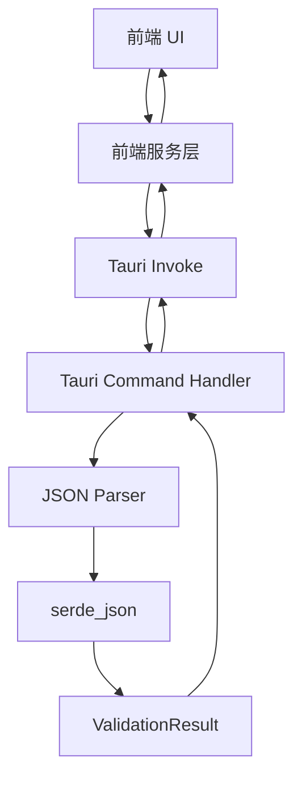
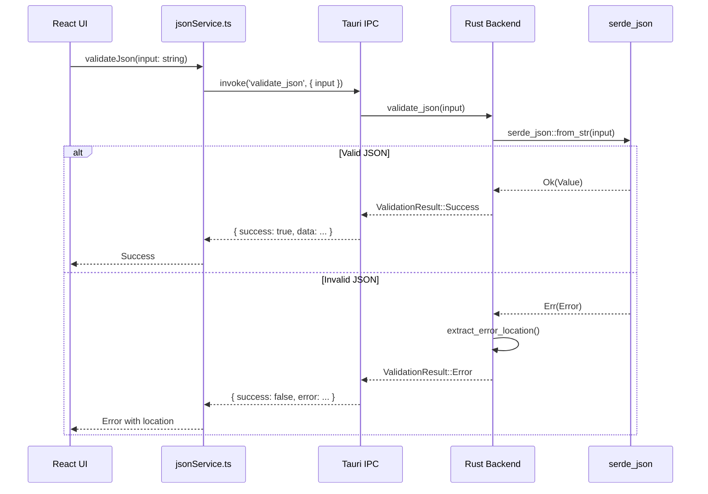

# Task 2: JSON Parsing & Validation Service - 系统设计

## 1. 任务概述

### 1.1 目标
实现核心的 JSON 解析和验证逻辑，能够检测 JSON 错误并返回带有行列号的详细错误信息。

### 1.2 验收标准
- ✅ 有效 JSON 输入返回成功状态和解析后的输出
- ✅ 无效 JSON 返回错误信息，包含行列号
- ✅ 支持最大 5 MB 的 JSON 载荷，不阻塞 UI 线程

---

## 2. 架构设计

### 2.1 整体架构



### 2.2 数据流



---

## 3. 数据结构设计

### 3.1 Rust 数据结构

```rust
// src-tauri/src/models/validation.rs

use serde::{Deserialize, Serialize};

/// JSON 验证结果
#[derive(Debug, Clone, Serialize, Deserialize)]
#[serde(tag = "type")]
pub enum ValidationResult {
    Success {
        /// 解析后的 JSON 值
        data: serde_json::Value,
        /// 输入大小（字节）
        size: usize,
    },
    Error {
        /// 错误消息
        message: String,
        /// 错误行号（从 1 开始）
        line: Option<usize>,
        /// 错误列号（从 1 开始）
        column: Option<usize>,
    },
}

/// 错误位置信息
#[derive(Debug, Clone, Serialize, Deserialize)]
pub struct ErrorLocation {
    pub line: usize,
    pub column: usize,
}
```

### 3.2 TypeScript 数据结构

```typescript
// src/types/validation.ts

export type ValidationResult =
  | {
      type: 'Success'
      data: unknown
      size: number
    }
  | {
      type: 'Error'
      message: string
      line?: number
      column?: number
    }

export interface JsonValidationError {
  message: string
  location?: {
    line: number
    column: number
  }
}
```

---

## 4. API 接口设计

### 4.1 Tauri Command

```rust
#[tauri::command]
async fn validate_json(input: String) -> Result<ValidationResult, String> {
    // 实现逻辑
}
```

**输入参数**:
- `input: String` - 待验证的 JSON 字符串

**返回值**:
- `Ok(ValidationResult)` - 验证成功或错误信息
- `Err(String)` - 系统级错误（如内存不足）

### 4.2 前端服务接口

```typescript
// src/services/jsonService.ts

export class JsonValidationService {
  /**
   * 验证 JSON 字符串
   * @param input - 待验证的 JSON 字符串
   * @returns 验证结果
   */
  async validateJson(input: string): Promise<ValidationResult>

  /**
   * 检查是否为有效 JSON
   * @param input - 待检查的字符串
   * @returns 是否有效
   */
  async isValidJson(input: string): Promise<boolean>
}
```

---

## 5. 实现逻辑

### 5.1 Rust 解析逻辑

```rust
pub fn validate_json(input: &str) -> ValidationResult {
    // 1. 检查输入大小
    if input.len() > 5 * 1024 * 1024 {
        return ValidationResult::Error {
            message: "Input exceeds 5 MB limit".to_string(),
            line: None,
            column: None,
        };
    }

    // 2. 尝试解析 JSON
    match serde_json::from_str::<serde_json::Value>(input) {
        Ok(value) => ValidationResult::Success {
            data: value,
            size: input.len(),
        },
        Err(error) => {
            // 3. 提取错误位置
            let (line, column) = extract_error_location(&error);
            ValidationResult::Error {
                message: error.to_string(),
                line,
                column,
            }
        }
    }
}

fn extract_error_location(error: &serde_json::Error) -> (Option<usize>, Option<usize>) {
    let line = error.line();
    let column = error.column();
    (Some(line), Some(column))
}
```

### 5.2 错误处理策略

#### 5.2.1 常见 JSON 错误

| 错误类型 | serde_json 错误 | 用户友好消息 |
|----------|----------------|--------------|
| 缺少引号 | `expected value at line X column Y` | "缺少引号或值不完整" |
| 多余逗号 | `trailing comma at line X column Y` | "有多余的逗号" |
| 缺少逗号 | `expected comma at line X column Y` | "缺少逗号分隔符" |
| 括号不匹配 | `EOF while parsing object` | "括号不匹配" |
| 非法字符 | `invalid escape at line X column Y` | "包含非法字符或转义序列" |

#### 5.2.2 错误消息转换

```rust
pub fn format_error_message(error: &serde_json::Error) -> String {
    let raw = error.to_string();

    // 转换为用户友好的消息
    if raw.contains("trailing comma") {
        "JSON 中存在多余的逗号".to_string()
    } else if raw.contains("expected comma") {
        "缺少逗号分隔符".to_string()
    } else if raw.contains("expected value") {
        "缺少值或引号不完整".to_string()
    } else if raw.contains("EOF while parsing") {
        "JSON 结构不完整，可能缺少括号".to_string()
    } else {
        raw
    }
}
```

---

## 6. 性能考量

### 6.1 异步处理

使用 Tauri 的异步 command 确保大文件不阻塞 UI：

```rust
#[tauri::command]
async fn validate_json(input: String) -> Result<ValidationResult, String> {
    // 在异步上下文中执行
    tokio::task::spawn_blocking(move || {
        validate_json_sync(&input)
    })
    .await
    .map_err(|e| e.to_string())?
}

fn validate_json_sync(input: &str) -> Result<ValidationResult, String> {
    Ok(validate_json(input))
}
```

### 6.2 内存限制

```rust
const MAX_JSON_SIZE: usize = 5 * 1024 * 1024; // 5 MB

pub fn validate_json(input: &str) -> ValidationResult {
    if input.len() > MAX_JSON_SIZE {
        return ValidationResult::Error {
            message: format!(
                "Input size ({:.2} MB) exceeds the maximum allowed size of 5 MB",
                input.len() as f64 / (1024.0 * 1024.0)
            ),
            line: None,
            column: None,
        };
    }
    // ...
}
```

### 6.3 性能基准

| 输入大小 | 预期处理时间 | 内存占用 |
|---------|-------------|---------|
| 1 KB | < 1 ms | < 10 KB |
| 100 KB | < 10 ms | < 500 KB |
| 1 MB | < 50 ms | < 5 MB |
| 5 MB | < 200 ms | < 25 MB |

---

## 7. 测试策略

### 7.1 Rust 单元测试

```rust
#[cfg(test)]
mod tests {
    use super::*;

    #[test]
    fn test_valid_json() {
        let input = r#"{"name": "test", "value": 42}"#;
        let result = validate_json(input);
        assert!(matches!(result, ValidationResult::Success { .. }));
    }

    #[test]
    fn test_invalid_json_missing_quote() {
        let input = r#"{"name: "test"}"#;
        let result = validate_json(input);
        assert!(matches!(result, ValidationResult::Error { .. }));
    }

    #[test]
    fn test_json_too_large() {
        let input = "a".repeat(6 * 1024 * 1024); // 6 MB
        let result = validate_json(&input);
        assert!(matches!(result, ValidationResult::Error { .. }));
    }

    #[test]
    fn test_error_location() {
        let input = "{\n  \"name\": \"test\",\n  \"value\": invalid\n}";
        let result = validate_json(input);
        if let ValidationResult::Error { line, column, .. } = result {
            assert_eq!(line, Some(3));
            assert!(column.is_some());
        } else {
            panic!("Expected error result");
        }
    }
}
```

### 7.2 测试用例

| 测试场景 | 输入 | 期望结果 |
|---------|------|----------|
| 空对象 | `{}` | Success |
| 空数组 | `[]` | Success |
| 嵌套对象 | `{"a":{"b":1}}` | Success |
| 缺少引号 | `{name: "test"}` | Error, line 1 |
| 多余逗号 | `{"a":1,}` | Error, line 1 |
| 缺少逗号 | `{"a":1 "b":2}` | Error, line 1 |
| 括号不匹配 | `{"a":1` | Error, EOF |
| 空字符串 | `` | Error |
| 纯文本 | `hello` | Error |

---

## 8. 项目结构

```
src-tauri/src/
├── main.rs                    # Tauri 入口，注册 commands
├── models/
│   ├── mod.rs
│   └── validation.rs          # ValidationResult 定义
├── services/
│   ├── mod.rs
│   └── json_parser.rs         # JSON 解析逻辑
└── utils/
    ├── mod.rs
    └── error_formatter.rs     # 错误消息格式化

src/
├── types/
│   └── validation.ts          # TypeScript 类型定义
├── services/
│   └── jsonService.ts         # 前端服务层
└── hooks/
    └── useJsonValidation.ts   # React Hook（可选）
```

---

## 9. 实施步骤

### Step 1: 创建 Rust 数据模型
- 创建 `src-tauri/src/models/` 目录
- 定义 `ValidationResult` 枚举

### Step 2: 实现 JSON 解析服务
- 创建 `src-tauri/src/services/json_parser.rs`
- 实现 `validate_json()` 函数
- 添加错误位置提取逻辑

### Step 3: 创建 Tauri Command
- 在 `main.rs` 中注册 `validate_json` command
- 实现异步处理逻辑

### Step 4: 定义前端类型
- 创建 `src/types/validation.ts`
- 定义 TypeScript 接口

### Step 5: 实现前端服务层
- 创建 `src/services/jsonService.ts`
- 封装 Tauri invoke 调用

### Step 6: 编写测试
- Rust 单元测试
- 前端集成测试（可选）

### Step 7: 验证功能
- 测试各种 JSON 输入
- 验证错误位置准确性
- 性能测试（5 MB 文件）

---

## 10. 验收检查清单

- [ ] 有效 JSON 返回 Success 结果
- [ ] 无效 JSON 返回 Error 结果
- [ ] 错误消息包含行列号
- [ ] 支持 5 MB 大小的 JSON
- [ ] 不阻塞 UI 线程
- [ ] Rust 单元测试全部通过
- [ ] 前端服务层可正常调用
- [ ] 错误消息用户友好

---

**文档版本**: 1.0
**创建日期**: 2025-10-23
**状态**: 设计完成，待实施
